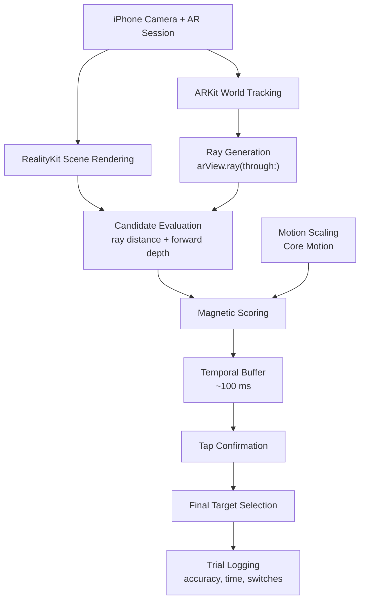

# MagRay: Intent-Aware Selection in Dense AR Scenes
## CS 8395 (Augmented Reality) - Rana Dubauskas

- Go to [Final Deliverable Section](#final-deliverable)
- Go to [MVD Section](#minimum-viable-design-mvd)

## Project Goal

This project introduces MagRay, an intent-aware ray-based selection technique for dense augmented reality environments. MagRay improves upon traditional straight selection rays with a "magnetic ray" that bends towards the likely target based on user intent and scene context. The system estimates user intent using hand kinematics, local scene density, and temporal locking. The magnetic attraction toward an object is adjusted in real time, allowing users to more easily select small targets in cluttered environments. Additionally, MagRay uses a temporal confirmation lock that freeze the selection during the final confirmation gesture to limit the Heisenberg effect.  

Accurate selection of targets in dense, cluttered AR scenes is a major challenge. Previous techniques of traditional ray-casting relies on high pointing precision and fails when many targets overlap in depth or there is a small movement from hand jitter. This problem is very critical in domains such as medical training, industrial maintenance, and accessibility scenarios where selecting the correct tiny target can have significant consequences. Prior work has improved AR target aquisition through approaches like target expansion, progressive refinement, adaptive control-to-display gain, and confirmation corrections. However, these appraoches address individual sources of error in isolation. MagRay introduces a unified, intent-aware selection technique that simultaneously considers scene density, user motion, and confirmation stability by dynamically bending the selection ray toward likely target while also stabilizing selection during confirmation. By integrating these signals into a single system, MagRay improves to imprive selection accuracy in dense AR environments while preserving speed and simplicity in ray-based interactions.

## Technical Approach

MagRay will be implemented as a mobile AR selection technique on iOS using Swift, SwiftUI, ARKit, RealityKit, and Core Motion. Instead of a headset-based hand ray, the system will use a screen-space-to-world-space ray cast from the center of the iPhone screen (or a tap location) into the AR scene. 

### Core Technologies
- **ARKit (ARWorldTrackingConfiguration)**
  - Provides 6DoF tracking of the iPhone pose relative to the environment.
  - Used to continuously estimate the camera position and orientation.
- **RealityKit**
  - Handles 3D scene rendering and entity management.
  - Used to create and render **ModelEntity** spheres that represent selectable targets.
- **CoreMotion**
  - Provides processed device motion data (`CMDeviceMotion`).
  - Used to create and render **ModelEntity** spheres that represent selectable targets.
- **SwiftUI + ARView**
  - Hosts the AR interface and handles gesture input (tap confirmation).

### Scene Setup
- An **AnchorEntity** will be placed in front of the camera.
- A dense cluster of small **ModelEntity spheres** will be generated around the anchor to create a cluttered selection environment.
- Each sphere will store its world position and a temporary magnetic score used by the selection algorithm.

### Ray Generation (Screen → World)
- A ray will be generated in each frame using: `arView.ray(through: screenPoint)`
- The screen point will normally be the center of the screen, functioning as an aiming reticle.
- The ray origin and direction will be used to evaluate candidate targets.

### Magenetic Target Selection
Instead of relying on RealityKit’s built-in hit test, MagRay computes a **custom score for each target.**

For each sphere:
- Compute the **shortest distance from the ray to the sphere center**
- Convert distance into a **proximity score((
- Optionally apply a **depth weighting**
```bash
score = proximity_weight * (1 / ray_distance)
      + depth_weight * depth_bias
```
The sphere with the highest score becomes the **current candidate target**.


### Motion-Aware Assistance
Magnetic snap strength will adapt based on device movement.

Using **Core Motion:**
- Compute motion magnitude from: **rotation rate** and **user acceleration**
- Behavior:
  - Phone moving fast → weaker magnetic snap
  - Phone steady → stronger magnetic snap

This allows the system to distinguish between navigation motion and careful aiming.

### Temporal Confirmation Lock

Selection confirmation occurs with a **screen tap.**

To reduce disturbances caused by touching the phone:

- Maintain a short **rolling buffer (~80–120 ms)** of recent best targets.
- When the user taps, the system selects the most stable candidate from the recent buffer, rather than the instantaneous frame.

This reduces errors caused by device movement during the tap.

### Interaction Loop
1. ARKit updates device pose.
2. Core Motion updates device motion.
3. A world-space ray is generated from the screen center.
4. The algorithm evaluates all sphere candidates.
5. The highest-scoring target is highlighted.
6. The candidate is added to a short temporal history.
7. User taps for selection
8. The system selects the most stable candidate from the recent history.

### System Architecture
```bash
iPhone Camera + AR Session
        │
        ▼
ARKit World Tracking
        │
        ▼
Ray Generation (arView.ray)
        │
        ▼
Candidate Evaluation
(ray → sphere distance)
        │
        ▼
Magnetic Scoring
(proximity + depth)
        │
        ▼
Motion Scaling (Core Motion)
        │
        ▼
Temporal Buffer (~100 ms)
        │
        ▼
Tap Confirmation
        │
        ▼
Final Target Selection
```
### Environment Profile Summary:
- Platform: iOS Mobile Augmented Reality
- SDK / Tool: Apple ARKit + RealityKit
- SDK Version: iOS 26.2 SDK (ARKit + RealityKit included in Xcode)
- Host OS: macOS 15.6 (24G84)
- IDE: Xcode 26.2
- Target OS: iOS 26.2
- Language / UI: Swift + SwiftUI

**AR Frameworks:**
- ARKit (world tracking, camera pose estimation)
- RealityKit (scene graph, rendering, ModelEntity objects)

**Motion Framework:**
- Core Motion (CMDeviceMotion for rotation rate and user acceleration)

**Target Hardware:** 
iPhone 15 Plus

## Novelty and Contribution

MagRay is a systems integration and modification of existing AR selection techniques. 

Prior work in AR selection has explored techniques such as:
- **Target expansion** (e.g., Bubble Cursor / Bubble Ray) to enlarge effective target size
- **Progressive refinement** (e.g., Depth Ray, SQUAD) to resolve clutter through multi-step selection
- **Adaptive control-to-display gain** to improve precision during slow movement
- **Confirmation-aware methods** to correct errors caused by the click or pinch gesture

However, these techniques typically address one source of error at a time. Additionally, most are designed for headset-based VR/AR systems using hand rays or controllers.

MagRay is an integration of these ideas adapted for mobile AR. The system combines three previously separate mechanisms into a single intent-aware selection pipeline:
- **Magnetic proximity scoring** to expand the effective selection region of nearby objects
- **Motion-aware assistance** using device motion to infer whether the user is navigating or precisely aiming
- **Temporal confirmation** locking to reduce selection errors caused by the tap gesture

Aditionally, MagRay explores these ideas under a screen-space-to-world-space mobile AR interaction model, where the selection ray originates from the phone camera rather than a tracked hand.

**Contribution Summary:**
- A **mobile AR implementation** of an intent-aware magnetic selection technique
- A **unified selection pipeline** integrating proximity scoring, motion-aware assistance, and temporal confirmation stabilization
- An evaluation of whether this integration improves target selection accuracy in **dense AR** scenes

## Evaluation Plan
To evaluate whether MagRay improves target selection in dense AR scenes, I will conduct a  target acquisition experiment comparing MagRay against a baseline ray-casting technique.

### Experimental Variables

**Interaction Techniques:**
1. Baseline Ray Casting: Uses standard screen-space ray casting (object intersected by the ray is selected directly with no magnetic assistance or temporal stabilization)
2. MagRay: magnetic scoring + motion scaling + temporal lockin

**Density Conditions:**
To evaluate performance in cluttered environments, the number of targets will vary:
- **Low Density:** ~10 objects
- **Medium Density:** ~30 objects
- **High Density:** ~60 objects

Objects will be placed close together so that multiple targets lie near the ray direction.

### Setup

**10 participants** will be asked to select a highlighted target sphere among 10-20 spheres in the AR scene

**Trials:**

We will perform 12 trials per density per interaction technique. Therefore, we will have a total of 3 (densities) * 2 (interaction techiques) * 12 trials = **72 total trials**.

### Metrics
The system will automatically log:
- **Selection Accuracy:** Percentage of correct targets selected
- **Selection Time:** Time from target appearance to confirmation in ms
- **Error Rate:** Percentage of incorrect selections
- **Ray Stability:** Number of times the best candidate changes (candidate-switch count)

### Success Criteria

MagRay will be considered successful if it meets the following conditions when compared to baseline ray casting:
- **Lower error rate:** MagRay reduces incorrect selections by at least **15–20%** in medium and high density scenes.
- **Comparable or improved selection time:** Average selection time remains **within ±10% of the baseline** or becomes faster.
- **Higher accuracy in dense scenes:** In the high-density condition, MagRay achieves at least a 10% higher target selection accuracy than baseline ray casting.
- **Improved ray stability:** The average **candidate-switch count** in the 80–120 ms window before confirmation is lower than the baseline

## Milestones and Contingencies

### Minimal Viable Demo (MVD)
The minimum viable version of MagRay will include:
- An ARKit + RealityKit scene running on iPhone
- Adense cluster of selectable sphere targets
- A ray generated from the center of the screen
- A custom magnetic scoring function selecting the closest target to the ray

### Development Milestones

**Milestone 1 – AR Scene Setup**
- Initialize ARKit session using ARWorldTrackingConfiguration
- Create RealityKit scene with AnchorEntity
- Spawn dense cluster of ModelEntity spheres

**Milestone 2 – Ray Generation**
- Implement screen-space ray generation using arView.ray(through:)
- Visualize aiming reticle and highlight intersected sphere

**Milestone 3 – Magnetic Selection Algorithm**
- Compute ray-to-sphere distances
- Implement proximity-based magnetic scoring
- Highlight current best candidate

**Milestone 4 – Motion-Aware Scaling**
- Integrate Core Motion (CMDeviceMotion)
- Scale magnetic snap strength based on device movement

**Milestone 5 – Temporal Locking**
- Implement short history buffer of recent candidate targets
- Select most stable candidate at tap confirmation

**Milestone 6 – Evaluation Experiment**
- Implement experiment mode with randomized target selection
- Log selection accuracy and time
- Run evaluation trials and analyze results

### Hardest Technical Challenges
The most challenging components are likely:
- Computing **stable ray-to-object** scoring in a cluttered scene
- Preventing **rapid flickering between candidate targets**
- Balancing magnetic snap strength so it **assists but does not override user intent**

### Contingency Plan
If the full MagRay system proves too complex we will try one of the following simpler versions:
1. Implement magnetic proximity scoring only (no motion scaling).
2. Implement temporal confirmation locking only to stabilize selections.
3. Evaluate ray proximity snapping vs baseline ray casting without motion-based adaptation.

## Minimum Viable Design (MVD)

[Demo Video Link](https://vimeo.com/1178952293?share=copy&fl=sv&fe=ci)

The MVD for MagRay demonstrates that the core technical challenge of the project is feasible: an intent-aware target selection pipeline for dense mobile AR scenes running end-to-end on an iPhone. It validates that selecting a likely target in clutter using a custom ray-based scoring pipeline works in a simplified but functional form

### What is Currently Implemented

The current MVD includes a working mobile AR prototype built with **Swift, SwiftUI, ARKit, RealityKit, and Core Motion** on iPhone. The prototype supports:
- A live **ARKit world-tracked scene**
- A generated cluster of selectable **RealityKit sphere targets**
- A **screen-center selection ray** using `arView.ray(through:)`
- A **custom candidate evaluation pipeline** based on ray-to-target distance rather than RealityKit’s default hit testing
- **Baseline vs MagRay** comparison modes
- **Motion-aware magnetic assistance**, where snap strength changes based on device motion
- **Temporal confirmation stabilization / confirmation locking** to reduce errors caused by the confirmation gesture
- An **experiment mode** with randomized target selection, density conditions, and logging of trial metrics such as accuracy, selection time, and candidate-switch count

### What the MVD Demonstrates

The current prototype shows that MagRay can:
1. Generate a world-space ray from the center of the phone screen
2. Evaluate multiple nearby targets in a cluttered AR scene
3. Select a current best candidate using a custom magnetic scoring function
4. Adapt assistance strength using device motion
5. Stabilize final selection during confirmation

This is the core technical challenge of the system. The most important feasibility question for the project was whether it would be possible to replace simple ray intersection with a richer, intent-aware selection mechanism that still runs live on a mobile device. The MVD shows that this is feasible.

### What Remains to be Implemented or Improved

The main work remaining after the MVD is not the basic feasibility of MagRay, but refinement and evaluation. Remaining tasks include:
- Improving the visual presentation of the selection technique
- Tuning magnetic snap strength and temporal locking parameters
- Reducing candidate flicker in dense scenes
- Improving experiment usability and trial flow
- Collecting and analyzing evaluation data across all study conditions
- Replacing synthetic spheres with more realistic target objects if time permits

### Technical Issues Encountered
Several issues emerged during implementation:

- Ray on screen was blocking visibility of scene --> had to make thinner
- Candidate flickering between nearby targets in dense scenes
- Balancing snap strength so that MagRay assists the user without feeling overly “sticky,”
### Technical Issues Encountered
- AR performance and world-tracking stability under heavier scene (`ARWorldTrackingTechnique ... World tracking performance is being affected by resource constraints [33 ]`)
- Designing a visualization that communicates “magnetic” behavior clearly without misleading the user

### Scope Changes

The original proposal framed MagRay partly as a “magnetic ray” that bends toward likely targets. During development, the project evolved toward a more concrete and technically robust interpretation: a straight screen-center ray combined with intent-aware target scoring, motion scaling, and confirmation stabilization. This is still consistent with the project’s novelty claims, but it shifts the emphasis from visual ray deformation to the underlying selection pipeline itself. The novelty claim is therefore now more accurately centered on the unified intent-aware selection system rather than on a literal geometric ray-bending visualization.

### Contingency & Risk Assessment

The highest remaining technical risk is no longer whether MagRay can be implemented, but whether the final system will show a strong enough improvement over baseline in dense scenes while still feeling natural to use. The main remaining risks are:
- The possibility that magnetic assistance may help accuracy but slow down selection
- The possibility that confirmation locking may feel overly sticky if not tuned carefully
- The challenge of making the system’s benefit obvious in user evaluation

If needed, the contingency path is to simplify the final system and evaluate the strongest subset of the technique, such as:
1. Magnetic proximity scoring + baseline comparison only
2. Temporal confirmation stabilization + baseline comparison only
3. Magnetic scoring + temporal stabilization without motion-aware scaling


# Final Deliverable
- [Video](https://vimeo.com/manage/videos/1183438882)
- [Images](https://github.com/ranadubauskas/AR-Project/tree/main/Images)

## Introduction & Goal
MagRay is an intent-aware AR target selection technique designed for dense mobile AR scenes. This project addresses a core interaction problem in handheld AR: as scenes become more crowded, selecting a small target with a simple ray becomes slower, more draining, and more error-prone. Traditional ray casting gives the user direct control, but it can be difficult to stabilize the phone and confirm a selection accurately when many targets are close together or overlapping.

The goal of this project was to design and implement a selection method that preserves the familiarity of center-screen ray selection while improving usability in cluttered scenes. MagRay extends baseline ray casting with a custom target scoring pipeline, temporal confirmation stabilization, and motion-aware assistance. Rather than relying only on strict geometric intersection, the system estimates which target the user most likely intends to select and uses that estimate to make confirmation easier and less physically demanding.

The main gap this project targets is the tradeoff between direct but error-prone selection and assistive but potentially unpredictable selection in mobile AR. MagRay explores whether an intent-aware technique can make selection faster and smoother without requiring additional hardware, external controllers, or large changes to the user’s interaction model.

## System Design and Implementation
### Final System Overview

The final system is a mobile AR prototype built for **iPhone** using **Swift, SwiftUI, ARKit, RealityKit, and Core Motion**. The application renders a cluster of selectable 3D targets in front of the user and allows comparison between two techniques:
        - **Baseline Ray Casting:** the selected target is determined directly from the center-screen ray and current candidate.
        - **MagRay:** the selected target is determined using a custom scoring mechanism that considers proximity to the ray, temporal stabilization, and device motion.
At a high level, the system works as follows:
1. ARKit tracks device pose and camera motion.
2. RealityKit renders a dense cluster of targets in 3D space.
3. A screen-center ray is projected from the phone view.
4. Candidate targets are scored continuously.
5. The current best candidate is highlighted.
6. A tap gesture confirms selection.
7. In MagRay mode, temporal locking helps reduce confirmation errors caused by phone motion at tap time.
8. The experiment manager logs trial-level metrics such as correctness, selection time, and candidate-switch count.

### Final System Architecture

The architecture can be understood as a staged intent-aware selection pipeline:

1. **iPhone Camera + AR Session**  
   Captures the live handheld AR view and provides the user’s current viewing context.

2. **ARKit World Tracking**  
   Estimates the phone’s position and orientation in 3D space so the system knows where the camera is and how it is moving.
3. **Ray Generation (`arView.ray(through:)`)**  
   Generates a world-space ray from the center of the screen, which acts as the aiming reticle.
4. **Candidate Evaluation**  
   Computes geometric features for each target, including shortest ray-to-target distance and forward depth.
5. **Magnetic Scoring**  
   Ranks targets using an intent-aware score that favors objects near the ray and reasonably aligned with the user’s aim.
6. **Motion Scaling (Core Motion)**  
   Adjusts the amount of magnetic assistance based on device motion, reducing snap strength during fast movement and increasing it during careful aiming.
7. **Temporal Buffer (~100 ms)**  
   Stores recent candidate history so that selection at tap time is based on the most stable recent candidate rather than a single noisy frame.
8. **Tap Confirmation**  
   The user confirms the selection with a tap anywhere on the screen.
9. **Final Target Selection + Logging**  

### Core Technical Components
#### Selection Pipeline
MagRay was implemented as a continuous target evaluation pipeline running on top of ARKit and RealityKit. Each frame, the system projects a ray from the center of the screen using `arView.ray(through:)` and evaluates all currently visible targets against that ray.

For each target, the system computes:
        - **Forward depth:** how far along the ray direction the target lies
        - **Ray-to-target distance:**the shortest Euclidean distance from the ray to the target center
This produces a geometric estimate of how close each target is to the user’s current aim.

#### Baseline Ray Casting
The Baseline condition uses a strict, low-assistance rule. A target is only considered selectable if it lies very close to the ray centerline. Among eligible targets, the target with the smallest ray distance is chosen as the current candidate.

The idea is to:
        - Reject targets outside a narrow ray-distance threshold
        - Choose the closest remaining target to the ray

#### MagRay Candidate Scoring

MagRay replaces strict thresholding with a softer intent-aware scoring model. Instead of requiring a target to lie exactly on the center ray, nearby targets are scored according to both:
        - Proximity to the ray
        - Depth relative to the user
The implemented score combines these terms approximately as:

```math
score = \frac{\text{snapStrength}\cdot \text{rayDistance}}{1+\epsilon} + 0.15 \cdot \frac{1}{\text{forwardDepth}+0.25}
```

where
- `rayDistance` is the shortest distance from the ray to the target center
- `forwardDepth` is the target’s distance along the ray direction
- `snapStrength` controls how strongly the system should “magnetically” favor nearby targets
- `epsilon` is a small constant to avoid division instability

This means MagRay favors targets that are:
- Close to the screen-center ray
- Not excessively far away
- Likely to reflect the user’s intended aim, even if not perfectly centered

#### Motion-Aware Assistance
A major part of the implementation was adapting the amount of magnetic assistance based on device motion. The system measures both the phone’s rotation rate and user acceleration using Core Motion. At each update, it computes the magnitude of the rotational velocity vector and the magnitude of the acceleration vector, then adds them together to produce a single raw motion value. To avoid abrupt frame-to-frame changes, this raw motion signal is smoothed with an exponential moving average:
```math
smoothedMotion=0.85⋅smoothedMotion+0.15⋅rawMotion
```
The smoothed motion value is then mapped into a normalized range using lower and upper thresholds. Motion below the lower threshold is treated as essentially still, while motion above the upper threshold is treated as fast movement. Values in between are linearly scaled to `[0,1]`. Finally, this normalized motion value is used to reduce magnetic snap strength: when the phone is relatively still, snap strength remains high, and when the phone is moving quickly, snap strength is decreased so the system does not over-assist during rapid motion. In the implementation, the final snap strength is computed as:
```math
snapStrength=1.0−0.75⋅normalizedMotion
```
This means the assistive effect is strongest during careful aiming and weaker during fast movement, making the interaction feel more stable and less sticky.

#### Temporal Confirmation Stabilization

To reduce confirmation errors caused by tapping, the system uses a short temporal history buffer. Instead of confirming only the instantaneous candidate at the exact tap moment, MagRay stores recent candidate selections over a short time window and identifies the most stable candidate in that interval.

This was implemented with a `TargetHistoryBuffer` that records candidate samples over a recent time window and returns the candidate that appears most consistently during that window.

### Key Design Decisions
- The project evolved from an initial “magnetic ray” idea toward a more practical interpretation: a straight center ray combined with intent-aware scoring and stabilization.
- Scenes were matched across Baseline and MagRay using fixed layoutSeed and targetIndex pairs to allow fair comparisons.
- Trial order was randomized so that the same scene would not appear back-to-back across techniques.
- The system kept the interaction simple: the user still aims with the phone and taps anywhere to confirm.
- The final evaluation used synthetic sphere targets rather than realistic 3D objects. This decision was made to keep target size, visibility, and appearance consistent across trials. Early tests with imported objects introduced issues such as inconsistent scaling, pivot/alignment problems, and material/rendering differences, which made it harder to isolate the effect of the selection technique itself. Using synthetic objects allowed the experiment to focus on selection behavior without those extra confounds.


### Challenges Encountered
- **Scene location shifting depending on phone position:** new scenes initially spawned relative to the current phone pose in a way that sometimes caused the next target cluster to appear too high or in an awkward position.
- **Intended sphere hidden by others due to density:** in dense layouts, the highlighted target could become partially or fully occluded by nearby spheres.
- **Scene reproducibility issues early on:** at first, the exact same layout was not being regenerated consistently across repeated trial runs.
- **Need for randomized ordering:** once matched layouts were working, it became clear that showing the same scene twice in a row made the second trial artificially easier because the participant already knew where the target was.
- **Temporal locking parameter tuning:** The stabilization window had to be carefully tuned so it reduced tap-time errors without incorrectly locking onto a previous target.
- **Balancing assistance against user control:** Stronger magnetic snapping could improve speed but also made the system feel less predictable and harder to override when it chose the wrong target.
- **Reliable trial logging and export:** The system had to consistently record and export trial metrics such as accuracy, timing, and candidate switches in a usable format for later analysis.
- **Transition from synthetic spheres to realistic objects:** Replacing spheres with imported 3D objects introduced additional problems with scale, visibility, pivot alignment, and visual consistency.

## Scope Changes

The original project concept emphasized a visibly “magnetic” ray that bends toward intended targets. During implementation, the system became more grounded in a practical, testable pipeline: a fixed center ray, candidate scoring, motion scaling, and confirmation stabilization. This is still consistent with the original idea, but the novelty shifted from the visual appearance of the ray to the interaction logic behind target selection.

## Compilation & Building Instructions

### Platform
- **Development platform:** macOS
- **Target device:** iPhone
- **Language:** Swift
- **Frameworks:** SwiftUI, ARKit, RealityKit, Core Motion
- **IDE:** Xcode

### Requirements
To build and run the project, you need:
- A Mac with Xcode installed
        - Install in the [App Store](https://apps.apple.com/us/app/xcode/id497799835?mt=12)
- An iPhone that supports ARKit
- A valid Apple Developer account or provisioning setup for installing the app on a physical device


### How to Build & Run
1. Clone or download the repository onto your Mac.
```bash
git clone https://github.com/ranadubauskas/AR-Project.git
```
2. **Open the project in Xcode:** Click the `.xcodeproj` file in the project folder
3. Connect your iPhone to your Mac using USBC cable
4. In Xcode, choose your iPhone as the build target.
5. Make sure code signing is configured correctly under Signing & Capabilities.
6. Build and run the project from Xcode.
7. Accept any device trust or developer permissions on the phone if prompted.


## Evaluation & Results

### Experimental Design
*Raw experimental data can be found in [experiment_results.json](https://github.com/ranadubauskas/AR-Project/blob/main/experiment_results.json)*

## Experimental Method

The evaluation used a repeated-measures AR target selection experiment comparing **Baseline Ray Casting** and **MagRay**.
- **Participants:** 10 participants
- **Demographic:**  Vanderbilt University college students
- **Age range:** 21–22 years old
- **Runs:** 10 total runs, one per participant
- **Trials per run:** 72
- **Total trials:** 720

Each participant completed randomized trials spanning three density conditions:
- Low density
- Medium density
- High density

The dataset was evenly balanced:
- 360 Baseline trials
- 360 MagRay trials
- 240 Low-density trials
- 240 Medium-density trials
- 240 High-density trials

Matched `layoutSeed` and `targetIndex` pairs ensured that Baseline and MagRay were tested on the same underlying scene layouts and intended targets, while trial order was randomized to reduce immediate memory effects.

### Quantitative Metrics
The evaluation used the following metrics:
- **Selection accuracy:** measures how often the participant selected the correct target. It tests overall correctness of the selection technique.
- **Error rate:** measures how often the participant selected the wrong target. It is the complement of accuracy and highlights failure frequency more directly.
- **Selection time:** measures how long it took the participant to complete a selection. It tests efficiency and speed of interaction.
- **Candidate-switch count:** measures how many times the highlighted candidate changed before confirmation. It tests stability of the selection technique and how much flickering or ambiguity the user experienced.


The evaluation used a repeated-measures AR target selection experiment comparing Baseline Ray Casting and MagRay. The study included 10 participants, all of whom wer##e Vanderbilt University college students. Each participant completed a run of 72 randomized trials across three density conditions: Low, Medium, and High. In total, the dataset consisted of 720 trials, evenly split between Baseline and MagRay and evenly distributed across density conditions. Trial order was randomized to reduce immediate memory and carryover effects, while matched layoutSeed and targetIndex pairs ensured that the two techniques were evaluated on the same underlying scene layouts and target selections.

### Table 1. Overall Performance by Mode

| Metric | Baseline Ray Casting | MagRay | Absolute Improvement | Relative Change |
|---|---:|---:|---:|---:|
| Overall Selection Accuracy | 90.3% | 87.8% | -2.5% | 2.8% worse |
| Overall Error Rate | 9.7% | 12.2% | +2.5% | 25.7% higher |
| Average Selection Time (ms) | 1450.0 ms | 1387.1 ms | -62.9 ms | 4.3% faster |
| Median Selection Time | 1330.2 ms | 1269.6 ms | -60.6 ms | 4.56% faster |
| Average Ray Stability (Switches) | 7.74 | 7.33 | -0.41 | 5.2% more stable |

#### Analysis
- Baseline was more accurate overall; MagRay had a higher overall error rate.
- MagRay was slightly faster and slightly more stable overall.
- Implication: MagRay improves speed and smoothness, but not overall correctness yet.

---

### Table 2. Performance by Density & Mode

| Density | Mode | Trials | Accuracy | Error Rate | Mean Time (ms) | Median Time (ms) | Mean Switches |
|---|---|---:|---:|---:|---:|---:|---:|
| High | Baseline | 120 | 86.7% | 13.3% | 1546.4 | 1413.0 | 9.12 |
| High | MagRay | 120 | 81.7% | 18.3% | 1409.7 | 1303.9 | 8.57 |
| Low | Baseline | 120 | 96.7% | 3.3% | 1373.3 | 1297.0 | 6.16 |
| Low | MagRay | 120 | 91.7% | 8.3% | 1363.0 | 1244.9 | 5.92 |
| Medium | Baseline | 120 | 87.5% | 12.5% | 1430.4 | 1334.6 | 7.92 |
| Medium | MagRay | 120 | 90.0% | 10.0% | 1388.7 | 1292.8 | 7.50 |

#### Analysis
- Low density: Baseline was better; MagRay adds little benefit when the task is already easy.
- Medium density: MagRay performed best, with better accuracy, speed, and stability.
- High density: MagRay was faster, but accuracy dropped too much.

---

### Table 3. Density-Specific MagRay vs. Baseline

| Density | Metric | Baseline | MagRay | Difference (MagRay - Baseline) | Interpretation |
|---|---|---:|---:|---:|---|
| High | Accuracy | 86.7% | 81.7% | -5.0 percentage points | MagRay was less accurate in high-density scenes |
| High | Mean Selection Time | 1546.4 ms | 1409.7 ms | -136.7 ms | MagRay was faster in high-density scenes |
| High | Mean Candidate Switches | 9.12 | 8.57 | -0.55 | MagRay was slightly more stable in high-density scenes |
| Low | Accuracy | 96.7% | 91.7% | -5.0 percentage points | MagRay was less accurate in low-density scenes |
| Low | Mean Selection Time | 1373.3 ms | 1363.0 ms | -10.3 ms | The speed difference was very small in low-density scenes |
| Low | Mean Candidate Switches | 6.16 | 5.92 | -0.24 | MagRay was only slightly more stable in low-density scenes |
| Medium | Accuracy | 87.5% | 90.0% | +2.5 percentage points | MagRay was more accurate in medium-density scenes |
| Medium | Mean Selection Time | 1430.4 ms | 1388.7 ms | -41.7 ms | MagRay was faster in medium-density scenes |
| Medium | Mean Candidate Switches | 7.92 | 7.50 | -0.42 | MagRay was slightly more stable in medium-density scenes |

#### Analysis
- MagRay was faster and a bit more stable at every density.
- Accuracy only improved in Medium density; it got worse in Low and High.
- Main implication: MagRay helps most in moderate clutter, not very easy or very hard scenes.

---

### Table 4. Per-Experiment Summary by Mode

| Experiment | Mode | Trials | Accuracy | Mean Time (ms) | Median Time (ms) | Mean Switches |
|---:|---|---:|---:|---:|---:|---:|
| 1 | Baseline | 36 | 91.7 | 1467.2 | 1376.0 | 7.47 |
| 1 | MagRay | 36 | 88.9 | 1529.8 | 1452.1 | 6.94 |
| 2 | Baseline | 36 | 88.9 | 1590.8 | 1289.9 | 8.67 |
| 2 | MagRay | 36 | 91.7 | 1265.5 | 1169.0 | 7.64 |
| 3 | Baseline | 36 | 86.1 | 1504.7 | 1325.1 | 8.08 |
| 3 | MagRay | 36 | 88.9 | 1351.8 | 1259.9 | 7.94 |
| 4 | Baseline | 36 | 88.9 | 1397.7 | 1305.5 | 7.22 |
| 4 | MagRay | 36 | 88.9 | 1466.7 | 1364.6 | 7.72 |
| 5 | Baseline | 36 | 94.4 | 1385.1 | 1326.9 | 7.58 |
| 5 | MagRay | 36 | 91.7 | 1687.5 | 1336.1 | 8.11 |
| 6 | Baseline | 36 | 88.9 | 1596.8 | 1379.8 | 7.72 |
| 6 | MagRay | 36 | 86.1 | 1275.1 | 1236.4 | 6.83 |
| 7 | Baseline | 36 | 88.9 | 1459.1 | 1299.6 | 8.11 |
| 7 | MagRay | 36 | 88.9 | 1386.1 | 1199.4 | 7.08 |
| 8 | Baseline | 36 | 97.2 | 1452.5 | 1366.2 | 7.58 |
| 8 | MagRay | 36 | 77.8 | 1409.5 | 1276.2 | 7.81 |
| 9 | Baseline | 36 | 94.4 | 1331.3 | 1310.0 | 7.25 |
| 9 | MagRay | 36 | 80.6 | 1296.0 | 1245.4 | 6.69 |
| 10 | Baseline | 36 | 83.3 | 1314.8 | 1207.4 | 7.67 |
| 10 | MagRay | 36 | 94.4 | 1203.5 | 1184.4 | 6.53 |

#### Analysis
- Results vary a lot across runs: some experiments favor MagRay, others favor Baseline.
- MagRay’s speed and stability gains are more consistent than its accuracy gains.
- This suggests layout-specific effects or fragile tuning are still influencing outcomes.

---

### Table 5. Comparison for Matched Layouts (Same Scene/Target)

| Density | Matched Pairs | MagRay better accuracy | Baseline better accuracy | Accuracy tie | MagRay faster | Baseline faster | MagRay fewer switches | Baseline fewer switches |
|---|---:|---:|---:|---:|---:|---:|---:|---:|
| High | 120 | 11 | 17 | 92 | 66 | 54 | 55 | 45 |
| Low | 120 | 3 | 9 | 108 | 73 | 47 | 53 | 47 |
| Medium | 120 | 14 | 11 | 95 | 59 | 61 | 61 | 42 |

#### Analysis
- This is the fairest comparison because both methods see the same exact scene/target pair.
- Medium density favors MagRay more often; High density favors Baseline more often.
- Low density is mostly ties, meaning assistance is not very necessary there.

---

### Table 6. Failures by Density & Mode

| Density | Mode | Failures | Error Rate | Mean Error Time (ms) |
|---|---|---:|---:|---:|
| High | Baseline | 16 | 13.3% | 1891.4 |
| High | MagRay | 22 | 18.3% | 1475.1 |
| Low | Baseline | 4 | 3.3% | 1438.3 |
| Low | MagRay | 10 | 8.3% | 1216.5 |
| Medium | Baseline | 15 | 12.5% | 1282.0 |
| Medium | MagRay | 12 | 10.0% | 1336.8 |

#### Analysis
- MagRay had fewer failures only in Medium density.
- In Low and High density, MagRay produced more errors than Baseline.
- MagRay’s errors also tended to happen faster, suggesting quick wrong snaps rather than slow searching.

---

### Overall Analysis
- Strongest result: MagRay looks most promising in Medium density.
- Biggest weakness: High-density accuracy is still not reliable enough.
- Best next step: fix bad layouts and retune High-density behavior while preserving the Medium-density benefit.

### Post-Experiment Survey

Each participant completed a survey about their subjective experience after the experiments.

The survey included the following questions:

1. **Which selection technique (Baseline Ray Casting or MagRay) did you prefer overall, and why?**  
   - [ ] Baseline Ray Casting  
   - [ ] MagRay  

2. **In the most crowded, high-density scenes, which technique made you feel more confident in your selection, and what made it feel that way?**  
   - [ ] Baseline Ray Casting  
   - [ ] MagRay  

3. **How predictable and natural did MagRay's "magnetic snap" feel when aiming at targets?**  
   - [ ] 1 — Completely unpredictable  
   - [ ] 2  
   - [ ] 3  
   - [ ] 4 — Neutral  
   - [ ] 5  
   - [ ] 6  
   - [ ] 7 — Highly predictable  

4. **Compare the physical effort (carefully aiming and holding your hand still while tapping) required for both techniques:**  
   - [ ] 1 — MagRay required significantly less physical effort than Baseline  
   - [ ] 2  
   - [ ] 3  
   - [ ] 4 — They required the same amount of effort  
   - [ ] 5  
   - [ ] 6  
   - [ ] 7 — MagRay required significantly more physical effort than Baseline  

### Qualitative Survey Results (N = 10)

| Participant | Q1: Overall Preference & Rationale | Q2: High-Density Confidence | Q3: Predictability (1–7) | Q4: Physical Effort (1–7)* | Q5: Most Frustrating Part |
|---|---|---|---:|---:|---|
| P1 | **Baseline.** I liked knowing that exactly what the center dot was touching was what would be selected. | **Baseline.** “MagRay felt like it was guessing in the really crowded scenes, and it often guessed wrong.” | 3 | 2 | “The flickering. When targets were clustered tightly, the highlight would jump back and forth so fast I couldn't time my tap.” |
| P2 | **MagRay.** It was just so much faster. I didn't feel like I had to aim perfectly, I just kind of swiped and tapped. | **MagRay.** “I just let the magnet do the work. Even if it missed sometimes, it was less stressful than aiming.” | 6 | 1 | “Trying to select a sphere that was hiding behind another one. The system heavily favored the one in front.” |
| P3 | **MagRay.** The baseline made my hand cramp up trying to hold the phone perfectly still while tapping the screen. | **Baseline.** “In high density, MagRay kept grabbing spheres on the edge of the cluster instead of the center one I wanted.” | 4 | 2 | “Sometimes the temporal lock felt like it locked onto the previous target I was looking at just as I moved my hand.” |
| P4 | **Baseline.** MagRay was fine for spaced-out objects, but I care more about accuracy than speed. | **Baseline.** “I felt like I had to fight the magnetic pull to get the target I actually wanted.” | 2 | 3 | “Feeling like I wasn't entirely in control. The assistance was too strong.” |
| P5 | **MagRay.** The tapping stabilization was great. With the baseline, the ray always shifted right when my finger hit the glass. | **Baseline.** “Too much clutter made MagRay too aggressive. Baseline was slow but steady.” | 5 | 2 | “When moving the phone quickly, it sometimes snapped to objects that weren't even near the center of the screen.” |
| P6 | **Baseline.** I found the magnetic snapping unpredictable. It was easier to just rely on my own aim. | **Baseline.** “With 60 targets, MagRay was a mess. It was impossible to isolate a specific sphere in the back.” | 2 | 4 | “The ‘stickiness’. I had to pull the phone away forcefully to break the snap to a wrong target.” |
| P7 | **MagRay.** It felt way more modern and fluid. Medium density was perfect for it. | **MagRay.** “It still felt faster, even if I made a couple of mistakes. Baseline took too much focus.” | 5 | 1 | “It was annoying when two targets were right next to each other and it kept selecting the slightly larger/closer one.” |
| P8 | **MagRay.** I have shaky hands, so the baseline technique was incredibly frustrating for me. MagRay fixed that. | **Baseline.** “Baseline gave me absolute certainty. MagRay made me second-guess if the highlight would jump.” | 4 | 1 | “In the really dense scenes, the highlight snapping around was visually distracting.” |
| P9 | **Baseline.** I prefer a direct 1:1 interaction. MagRay felt like an aim-assist in a video game that was turned up too high. | **Baseline.** “I knew exactly what I was pointing at. MagRay felt completely random in the dense clusters.” | 3 | 4 | “Trying to select depth. If a target was further back, the ray refused to ignore the targets in front of it.” |
| P10 | **MagRay.** Overall, the experience was smoother. The baseline felt very rigid and punishing if you were slightly off. | **Baseline.** “MagRay was great until the high density condition. Then it just grabbed whatever was closest.” | 5 | 2 | “When I accidentally selected the wrong thing really quickly because the magnet grabbed it right as I tapped.” |

### Subjective Results Analysis

#### Subjective Analysis
- Overall preference was split evenly: **5 participants preferred Baseline** and **5 preferred MagRay**.
- Participants who preferred **MagRay** most often cited **lower physical effort**, **faster interaction**, and a smoother overall feel.
- Confidence in **high-density scenes** strongly favored **Baseline**, with **8 out of 10 participants** saying it felt more reliable.
- A common complaint was that MagRay sometimes felt like it was **guessing** in dense scenes or snapping to the wrong target.
- Reported frustrations with MagRay included **flickering highlights**, **overly strong stickiness**, and difficulty selecting **occluded or deeper targets**.
- Predictability ratings were mixed, suggesting that MagRay felt helpful in some cases but **inconsistent** in others.
- Physical effort ratings generally favored **MagRay**, indicating that it reduced the strain of careful aiming and tap confirmation.
- These subjective results match the quantitative findings: **MagRay seems most promising in medium-density scenes**.
- The biggest remaining issue is **high-density usability**, especially improving control, predictability, and depth disambiguation.

#### Subjective Interpretation 
The subjective survey results align closely with the quantitative results. Participants often found MagRay smoother and less physically demanding, but they trusted Baseline more in highly crowded scenes. This reinforces the conclusion that MagRay is most effective in medium-density conditions, while high-density behavior still needs refinement.

## Conclusion
MagRay demonstrates that intent-aware assistance can improve target selection in handheld AR, but the effect is not uniform across all scene conditions. The strongest evidence from this project is that MagRay is most effective in **medium-density scenes**, where it improved accuracy, speed, and candidate stability relative to Baseline. In contrast, **low-density scenes** did not benefit much from assistance, and high-density scenes exposed the main weaknesses of the current system.

The main novelty of the project is a unified interaction pipeline that combines:
- Center-screen ray aiming
- Proximity-based candidate scoring
- Temporal confirmation stabilization
- Motion-aware assistance
- Matched-layout experimental evaluation

### Limitations
- **Limited participant demographic:** the study included only 10 participants, all Vanderbilt students aged 21–22.
- **User error:** some errors may have been influenced by hand slips or tapping mistakes.
- **Individual differences: in user ability** reflexes, visual acuity, focus, and familiarity with mobile interaction likely varied across participants.
- **Dense scene occlusion:** some intended targets could still be partially hidden or visually ambiguous in crowded layouts.
- **High-density reliability:** MagRay still struggled in the most crowded scenes, especially when multiple nearby targets competed strongly for selection
- **Learning & adaptation effects:** Although trial order was randomized, participants may still have improved over time as they became more familiar with the task, the reticle, and the selection behavior of each technique. This could influence later trials differently from earlier ones.

### Assumptions Unrealistic for Real-World Development/Application
- **Handheld-only evaluation:** The project was tested on a handheld iPhone setup. The findings may not transfer directly to other AR platforms such as head-mounted displays, tablets, or controller-based systems.
- **Single interaction style:** The system used center-reticle aiming plus tap confirmation. Results may differ with other confirmation methods, such as dwell, pinch, trigger input, or gesture-based selection.
- **Outcome measures focused on short-term performance:** The study measured immediate trial performance and short post-experiment impressions, but did not examine long-term learnability, adaptation, or user trust over repeated use.
- **Known target-selection task:** Participants were always asked to select a single highlighted intended target. Real AR applications often involve more open-ended tasks, shifting goals, multitasking, and less explicit guidance about what should be selected.
- **Limited environmental variability:** The experiments do not capture the full range of real-world conditions such as glare, poor lighting, background clutter, reflective surfaces, or interruptions, all of which could affect tracking and usability.


### What I Would Do With More Time
With more time I would:
- Improve high-density target ambiguity
- Reduce flicker and over-aggressive snapping
- Make assistance strength adaptive to clutter level
- Refine visibility constraints so intended targets remain clearly visible
- Run a larger and more diverse user study
- Test more realistic AR objects rather than only synthetic targets
- Explore additional confirmation methods beyond tap input, such as dwell, pinch, trigger, or gesture-based confirmation
- Study long-term learnability and user trust over repeated use, rather than focusing only on short-term task performance
- Investigate whether users adapt to MagRay over time and whether predictability improves with practice
- Evaluate the technique on other AR platforms, such as head-mounted displays or tablets, to see whether the results transfer beyond handheld iPhone use

Overall, the project demonstrates that intent-aware AR selection can improve interaction, but it is difficult it is to design assistance that users find both helpful and dependable. The main technical insight is that improvements in speed and reduced effort only matter if the system also maintains accuracy and user trust in dense scenes.
